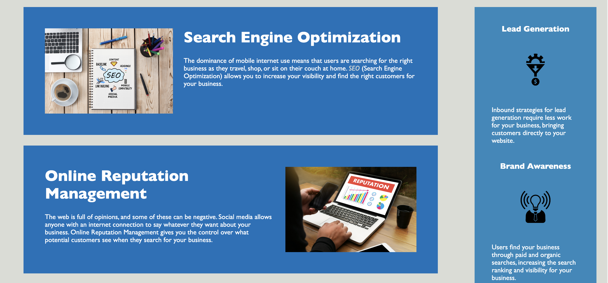

# horiseon-challenge
Refactoring a website for accessibility, displaying knowledge of semantic HTML, CSS styling, and new HTML tags and elements.

[Link to the site -- deployed on Github Pages]()

## Examples of the Website's Design

